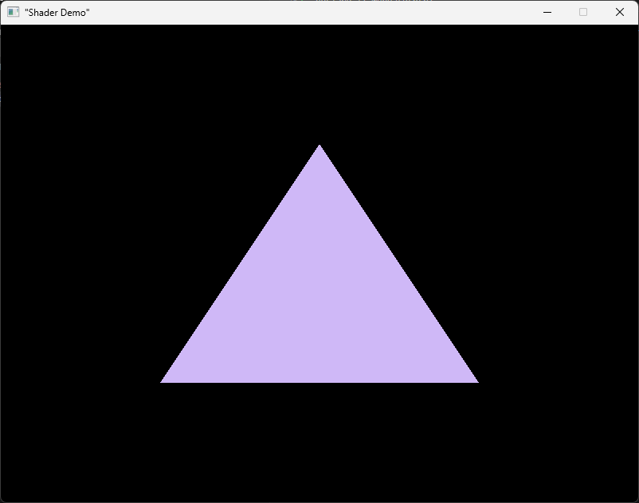

# Calcium

Shared programming language for the CPU and GPU.

## Examples

### Hello World
```kotlin
fun printf(* byte): int;

fun main(): unit {
    printf("Hello, world!");
}
```

#### Compilation and execution
```bash
./build-runtime.sh                # build runtime libraries (stdio, creating a basic window, ...)
./calcium examples/helloworld.ca  # compile program to .o
./build-local.sh                  # link program with runtime
./helloworld
```

#### Output
```
Hello, world!
```

### Shaders

```kotlin
// ---------------------------------------------------------------
// POC for my programming language for CPU and GPU.
//
// shader.ca - 2024
// 
// This demonstrates the ability to write GPU shaders and kernels
// in the same source file. The kernel function is compiled to 
// SPIR-V bytecode and can be used as a first-class primitive.
// ---------------------------------------------------------------

// native definitions from the runtime
struct Window;

fun createWindow(title: * byte, width: int, height: int): * Window;
fun setupDemoPipeline(* Window, * Kernel): unit;
fun update(* Window): unit;
fun closed(* Window): bool;
fun destroyWindow(* Window): unit;

// kernel/shader compiled to SPIR-V bytecode
ker fragmentShader(uv: vec2): vec4 {
    return vec4(0.623, 0.482, 0.929, 1.0);
}

fun main(): unit {
    let window: * Window = createWindow("Shader Demo", 800, 600);

    setupDemoPipeline(window, fragmentShader); // pass in compiled kernel

    while (!closed(window)) {
        update(window);
    }

    destroyWindow(window);
}

```

#### Generated LLVM and SPIR-V

```llvm
; ModuleID = 'Calcium'
source_filename = "Calcium"

%Kernel = type { ptr, i64 }

@code = constant [84 x i32] [i32 119734787, i32 65536, i32 0, i32 14, i32 0, i32 131089, i32 1, i32 393227, i32 1, i32 1280527431, i32 1685353262, i32 808793134, i32 0, i32 196622, i32 0, i32 1, i32 393231, i32 4, i32 2, i32 1852399981, i32 0, i32 3, i32 196624, i32 2, i32 7, i32 262215, i32 3, i32 30, i32 0, i32 131091, i32 4, i32 196641, i32 5, i32 4, i32 196630, i32 6, i32 32, i32 262167, i32 7, i32 6, i32 4, i32 262176, i32 8, i32 3, i32 7, i32 262203, i32 8, i32 3, i32 3, i32 262187, i32 6, i32 11, i32 1065353216, i32 262187, i32 6, i32 12, i32 0, i32 262187, i32 6, i32 13, i32 0, i32 262187, i32 6, i32 14, i32 1065353216, i32 327734, i32 4, i32 2, i32 0, i32 5, i32 131320, i32 9, i32 458832, i32 7, i32 10, i32 11, i32 12, i32 13, i32 14, i32 196670, i32 3, i32 10, i32 65789, i32 65592]
@fragmentShader = constant %Kernel { ptr @code, i64 84 }
@0 = private unnamed_addr constant [14 x i8] c"\22Shader Demo\22\00", align 1

declare ptr @createWindow(ptr, i32, i32)

declare i1 @setupDemoPipeline(ptr, ptr)

declare i1 @update(ptr)

declare i1 @closed(ptr)

declare i1 @destroyWindow(ptr)

define i1 @main() {
entry:
  %window = alloca ptr, align 8
  %calltmp = call ptr @createWindow(ptr @0, i32 800, i32 600)
  store ptr %calltmp, ptr %window, align 8
  %window1 = load ptr, ptr %window, align 8
  %calltmp2 = call i1 @setupDemoPipeline(ptr %window1, ptr @fragmentShader)
  br label %while.cond

while.cond:                                       ; preds = %while.body, %entry
  %window3 = load ptr, ptr %window, align 8
  %calltmp4 = call i1 @closed(ptr %window3)
  %not = xor i1 %calltmp4, true
  br i1 %not, label %while.body, label %while.end

while.body:                                       ; preds = %while.cond
  %window5 = load ptr, ptr %window, align 8
  %calltmp6 = call i1 @update(ptr %window5)
  br label %while.cond

while.end:                                        ; preds = %while.cond
  %window7 = load ptr, ptr %window, align 8
  %calltmp8 = call i1 @destroyWindow(ptr %window7)
  ret i1 false
}
```

#### Output




## Future Plans

* Executing compute shaders and specifying blocks/threads.
* Shared compile-time constants in CPU and GPU code.
* Shared/allocated memory and shader uniforms. 
* Actual semantic analysis.
